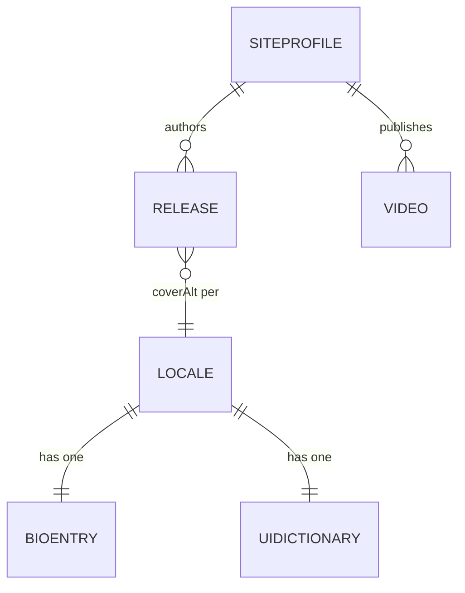

# Data Model

**Feature:** 001-astro-rework

Defines every entity the site renders, where it lives, and how it is validated. Schemas are
implemented in `src/content.config.ts`; this document is the specification they must satisfy.

---

## Locale

```ts
type Locale = 'en' | 'es' | 'ca' | 'nl';
```

`en` is the default and is served unprefixed. Ordering in the language switcher is
`en, es, ca, nl`.

---

## Release

A published song or album. One Markdown file per release in `src/content/releases/`.
Collection type: content collection, `glob()` loader, `*.md`.

| Field | Type | Required | Notes |
|---|---|---|---|
| `title` | string | yes | Not translated — release titles are proper nouns. |
| `cover` | image | yes | Resolved via the `image()` schema helper so `<Image>` can optimise it. |
| `coverAlt` | Record\<Locale, string\> | yes | Per-locale alternative text. Satisfies Principle V.2. |
| `releaseDate` | date | yes | Drives ordering, `datetime` attributes and JSON-LD. |
| `credits` | string | yes | e.g. `© 2026 XCB Studio`. Displayed verbatim. |
| `type` | `'single' \| 'album' \| 'ep'` | yes | Used for the JSON-LD type and the card label. |
| `featured` | boolean | no, default `false` | At most one release should be featured. |
| `order` | number | no, default `0` | Manual tiebreak; lower sorts first. |
| `links.spotify` | url | no | Canonical `open.spotify.com` URL, no `/intl-*/` segment. |
| `links.youtube` | url | no | Full watch URL. |
| `links.apple` | url | no | Reserved; unused today. |

**Invariants**

- At least one of `links.*` is present, otherwise the card has no call to action.
- `slug` is derived from the filename and is stable — it is used as the anchor id.

**Ordering:** `featured` first, then `releaseDate` descending, then `order` ascending.

### Seed data

| File | Title | Type | Credits | Spotify | YouTube |
|---|---|---|---|---|---|
| `the-archetype-iii-the-wanderer.md` | The Archetype III: The Wanderer | single | © 2026 XCB Studio | `track/53REbMHYYx6Krvu5ioXRIn` | — |
| `break-the-illusions.md` | Break The Illusions | single | © 2026 XCB Studio | `track/3acimGFmocle0Dv5tBNLtm` | — |
| `when-did-i-grow-up.md` | When Did I Grow Up | album | Recording, Mixing & Mastering: Icy Donuts Music Studio | `album/0IteIu5XQh9KhlctLH0heT` | `watch?v=xDuBDXz9_2Q` |

---

## BioEntry

The artist biography for one locale. One Markdown file per locale in `src/content/bio/`, named
`en.md`, `es.md`, `ca.md`, `nl.md`.

| Field | Type | Required | Notes |
|---|---|---|---|
| `locale` | Locale | yes | Must equal the filename stem. |
| `heading` | string | yes | Section heading — "About" / "Bio". |
| `role` | string | yes | "Artist / Composer / Performer", localised. |
| `location` | string | yes | "Roermond - Remote", localised. |
| *body* | Markdown | yes | The prose paragraph, rendered through `render()`. |

**Rationale for Markdown rather than a dictionary key:** the biography is authored prose that will
grow paragraphs and emphasis. Long-form text in a TypeScript string literal is how the previous
implementation became unmaintainable.

---

## SiteProfile

Stable, non-translated identity data. Lives in `src/data/site.ts` as a `const` object with an
explicit type — it is configuration referenced by code (JSON-LD, links), not authored content.

| Field | Type | Value |
|---|---|---|
| `name` | string | Xavier Crosas |
| `email` | string | xaviercrosasofficial@gmail.com |
| `social.instagram` | url | https://instagram.com/xaviercrosasofficial |
| `social.youtube` | url | https://youtube.com/@XavierCrosasOFFICIAL |
| `social.spotify` | url | https://open.spotify.com/artist/6PaPHlXXxfowSsJdvdxyke |

The YouTube **channel ID** is deliberately *not* here. It is infrastructure configuration read from
`YOUTUBE_CHANNEL_ID` in the environment (FR-10).

---

## UIDictionary

Interface strings for one locale. Lives in `src/i18n/ui.ts`.

The English dictionary is declared first and its shape defines the key type:

```ts
export const ui = {
  en: { /* … */ },
  es: { /* … */ },
  ca: { /* … */ },
  nl: { /* … */ },
} as const satisfies Record<Locale, Record<UIKey, string>>;
```

A missing or misspelled key in any locale is a compile error (FR-07).

| Key | Purpose |
|---|---|
| `nav.home` `nav.music` `nav.videos` `nav.about` `nav.contact` | Navigation labels. Flattened from the previous positional array so a label can never drift from its anchor. |
| `hero.kicker` `hero.title` `hero.body` `hero.primary` `hero.secondary` | Hero section. |
| `music.featured` | Label above a release title. |
| `videos.heading` `videos.empty` `videos.channel` | Videos section, including the fallback state. |
| `contact.heading` `contact.body` `contact.cta` | Contact section. |
| `meta.description` | Per-locale `<meta name="description">`. |
| `a11y.skipToContent` `a11y.openMenu` `a11y.closeMenu` `a11y.languageLabel` | Assistive labels. |
| `footer.tagline` | Footer line. |

`aboutTitle`, `aboutBody`, `aboutRole` and `location` from the old `copy` object move to
**BioEntry**. The old positional `nav` array is replaced by discrete keys.

---

## Video

A YouTube upload, derived at request time from the channel's public RSS feed. Not stored, not
authored — read-only projection of an external system.

| Field | Type | Required | Notes |
|---|---|---|---|
| `id` | string | yes | YouTube video id. Entries lacking one are discarded rather than given a random id. |
| `title` | string | yes | |
| `publishedAt` | ISO 8601 string | yes | Formatted per locale with `Intl.DateTimeFormat`. |
| `thumbnail` | url | yes | `https://i.ytimg.com/vi/{id}/hqdefault.jpg` |
| `url` | url | yes | `https://www.youtube.com/watch?v={id}` |

Maximum 5 items — named `MAX_VIDEOS`, not an inline literal.

Contract for the endpoint that produces these: [contracts/youtube-latest.md](./contracts/youtube-latest.md).

---

## Relationships



`Release` and `SiteProfile` are locale-independent. `BioEntry` and `UIDictionary` are per-locale.
`Video` is fetched once and rendered into whichever locale is being served, with only its date
formatting localised.
