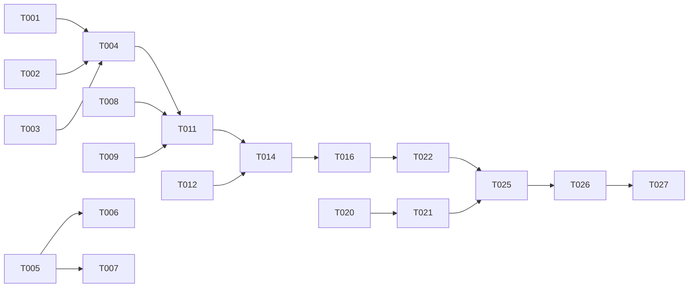

# Tasks — Idiomatic Astro Rework

**Feature:** 001-astro-rework
**Plan:** [plan.md](./plan.md)

`[P]` marks tasks that touch different files and may be done in parallel.
A task is done when its check passes and the constitution's Definition of Done holds.

---

## Phase 1 — Foundation

- [x] **T001** Set the production `site` URL in `astro.config.mjs`, replacing `https://example.com`.
  *Check:* built `sitemap-index.xml` contains no `example.com`. *(Fixes D-4)*

- [x] **T002** Add the `i18n` block to `astro.config.mjs`: `defaultLocale: 'en'`,
  `locales: ['en','es','ca','nl']`, `routing.prefixDefaultLocale: false`. Pass the matching `i18n`
  option to `sitemap()`.
  *Check:* `astro build` succeeds; sitemap entries carry `hreflang` alternates.

- [x] **T003** [P] Declare design tokens in a `@theme` block in `src/styles/global.css` — surface
  colour `#0b0b0d` and the border/text opacity ladder.
  *Check:* tokens resolve in a component; no visual change. *(Fixes D-11)*

- [x] **T004** Create `src/layouts/BaseLayout.astro` owning `<html lang>`, `<head>`, `<body>` and a
  `<slot />`. Props: `locale`, `title`, `description`. Emits charset, viewport, canonical,
  `hreflang` alternates for all four locales plus `x-default`, and a skip link as the first
  focusable element.
  *Check:* a page using it produces one valid document with nothing outside `</html>`. *(Fixes D-1)*

---

## Phase 2 — Content *(parallel with Phase 1)*

- [x] **T005** [P] Create `src/content.config.ts` with the `releases` and `bio` collections exactly
  as specified in [contracts/content-collections.md](./contracts/content-collections.md).
  *Check:* `astro sync` generates types; a deliberately broken field fails the build with the file
  named.

- [x] **T006** [P] Migrate the three releases into `src/content/releases/` —
  `the-archetype-iii-the-wanderer.md`, `break-the-illusions.md`, `when-did-i-grow-up.md` — with
  covers, credits, types and `coverAlt` in all four locales. Drop the `/intl-es/` segment from
  Spotify URLs.
  *Check:* all three validate; each has at least one link.

- [x] **T007** [P] Migrate the biography into `src/content/bio/{en,es,ca,nl}.md`, prose in the body,
  `heading` / `role` / `location` in frontmatter. Text is copied verbatim.
  *Check:* four entries load; `locale` matches each filename.

- [x] **T008** [P] Create `src/i18n/ui.ts` with the 4 locale dictionaries using
  `as const satisfies`, keyed as in [data-model.md](./data-model.md). Replace the positional `nav`
  array with discrete keys.
  *Check:* deleting a key from `es` is a compile error. *(Fixes D-6)*

- [x] **T009** [P] Create `src/i18n/utils.ts` with `getLocaleFromUrl`, `useTranslations`,
  `localisePath` and the `Locale` type.
  *Check:* `localisePath('/', 'en')` → `/`; `localisePath('/', 'nl')` → `/nl/`.

- [x] **T010** [P] Create `src/data/site.ts` with the artist name, email and social URLs, typed —
  no channel id (that is environment configuration).
  *Check:* no social URL literal remains in any component.

---

## Phase 3 — Routing *(needs T004, T008, T009)*

- [x] **T011** Create `src/pages/[lang]/index.astro` with `getStaticPaths()` returning `es`, `ca`,
  `nl` and `export const prerender = true`.
  *Check:* `dist/es/index.html`, `dist/ca/index.html`, `dist/nl/index.html` exist. *(Fixes D-3)*

- [x] **T012** Rewrite `src/pages/index.astro` as the English page using `BaseLayout`, with
  `prerender = true`. Remove the stray island and the meaningless `<slot />`.
  *Check:* `dist/index.html` is English and valid. *(Fixes D-1, D-2)*

---

## Phase 4 — Sections *(needs T011, T012)*

- [x] **T013** [P] Create `src/components/icons/*.astro` — inline SVGs for the nine glyphs used by
  the old component (arrow, mail, play, menu, close, music, disc, sparkles, Instagram, YouTube).
  *Check:* no `react-icons` import remains.

- [x] **T014** Create `Header.astro` with a single nav definition shared by desktop and mobile, plus
  `LanguageSwitcher.astro` rendering four links with the current locale marked
  `aria-current="true"`.
  *Check:* the anchor list exists once in the codebase. *(Fixes D-7)*

- [x] **T015** [P] Create `sections/Hero.astro` using `<Image />` for `xavi1.webp` with meaningful
  alt text and explicit dimensions. *(Fixes D-8)*

- [x] **T016** Create `sections/ReleaseCard.astro` and `sections/Music.astro` iterating the sorted
  `releases` collection.
  *Check:* three cards render; the markup exists once. *(Fixes D-7, D-8)*

- [x] **T017** [P] Create `sections/About.astro` rendering the locale's bio Markdown through
  `render()`.

- [x] **T018** [P] Create `sections/Contact.astro` and `Footer.astro`, preserving
  `data-obfuscation="1"` on the `mailto:` link.

- [x] **T019** Add the mobile-menu `<script>` in `Header.astro`: toggle, `aria-expanded`, focus
  trap, `Escape` to close, focus returned to the toggle.
  *Check:* keyboard-only operation works; no framework involved. *(Fixes D-10)*

---

## Phase 5 — Endpoint *(parallel with Phase 4)*

- [x] **T020** [P] Rewrite `src/pages/api/youtube-latest.ts` per
  [contracts/youtube-latest.md](./contracts/youtube-latest.md): `YOUTUBE_CHANNEL_ID` from the
  environment, `MAX_VIDEOS` and `UPSTREAM_TIMEOUT_MS` constants, `AbortSignal.timeout`,
  `s-maxage=1800, stale-while-revalidate=86400`, 502 on failure, entries without an id dropped, no
  `any`.
  *Check:* the contract's verification table passes. *(Fixes D-5)*

- [x] **T021** Create `sections/Videos.astro` that fetches during server rendering and outputs the
  cards as HTML, with dates via `Intl.DateTimeFormat` for the active locale and the localised
  `videos.empty` fallback.
  *Check:* video titles appear in `dist` HTML; no client fetch. *(Fixes D-2)*

---

## Phase 6 — SEO & accessibility *(needs Phase 4)*

- [x] **T022** Add Open Graph and Twitter card tags to `BaseLayout.astro`, with a per-locale title
  and description. *(Fixes D-9)*

- [x] **T023** [P] Add `MusicGroup` JSON-LD to `BaseLayout.astro` with `name`, `url` and `sameAs`
  pointing at the social profiles.
  *Check:* validates in a structured-data test tool.

- [x] **T024** [P] Add `target="_blank" rel="noopener noreferrer"` to every outbound link.
  *Check:* no external anchor lacks `rel`. *(Fixes D-10)*

---

## Phase 7 — Removal *(needs all previous)*

- [x] **T025** Delete `src/components/ArtistPortfolioStarter.tsx`.
  *Check:* build succeeds; nothing references it.

- [x] **T026** Remove `@astrojs/react`, `react`, `react-dom`, `react-icons`, `@astrojs/rss` and
  `@astrojs/mdx` from `package.json`; drop `react()` and `mdx()` from the integrations; remove the
  `jsx` compiler options from `tsconfig.json`.
  *Check:* `npm ci && npm run build` succeeds. *(Fixes D-12)*

- [ ] **T027** Run the full acceptance checklist in [spec.md](./spec.md) §7 and the verification
  list in [quickstart.md](./quickstart.md).
  *Check:* all nine acceptance criteria demonstrated.

---

## Dependency graph

Phase 2 (T005–T010) has no dependency on Phase 1 and may run alongside it.
